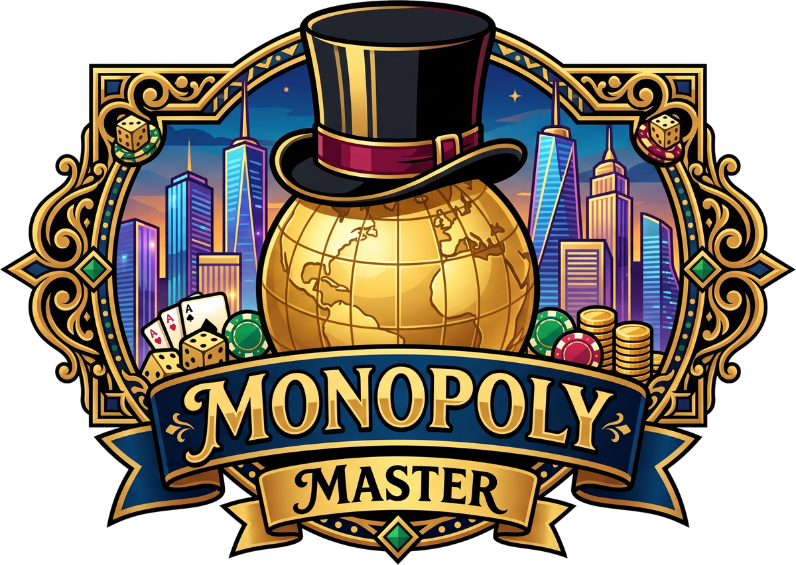

<div align="center">
  
  <h1>🎩 Monopoly Master Edition</h1>
  <p><strong>A complete, faithful, and visually rich digital implementation of the classic board game.</strong></p>

  []()
  []()
  []()
  []()
  []()
</div>

<br/>

Welcome to **Monopoly Master Edition**, a highly polished, interactive 2D web application that brings the timeless property trading game to your screen. Built with modern web technologies, this project features stunning animations, an advanced AI system, real-time multiplayer, deep strategic analytics, and an elegant UI.

---

## ✨ 🎮 Game Features

- **Dual Board Layouts**: Choose between the custom 36-tile World Edition or the faithful 40-tile Classic Edition.
- **Advanced AI Tycoons**: Play against intelligent bots using "Grandmaster Heuristics" for property buying, dynamic trading, and ROI-based house building.
- **Live Activity Feed & JSON Export**: Every action is tracked in real-time. Export complete match logs to JSON for post-game analytics.
- **Strategic Heatmap**: Overlay Markov Chain landing probabilities directly on the board to make data-driven decisions.
- **Rich Interactive UI**: Slide-out menus, particle effects (`fxCanvas`), 3D dice rolling animations, responsive modals, and property management hubs.
- **Multiplayer Mode**: Host and join rooms to play online with friends using WebSockets (`server.js`).
- **Dynamic Trade System**: Propose multi-asset trades with cash and properties. The AI evaluates offers based on monopoly synergy and fair value.
- **Post-Game Match Analytics & Tycoon Certificate**: When a game concludes, view match duration, full financial flow (rent collected/paid, GO salary, taxes, construction ROI), player standings, and printable ornate **Certificates of Tycoon Mastery** complete with official tournament seals and achievement grades (S+, S, A+, etc.).
- **Customizable Game Speed**: Toggle between Normal (1x), Fast (2x), and Turbo (4x) animation speeds.
- **Achievements System**: Unlock Steam-style toast notifications for milestones (see [Achievements](#🏆-achievements)).
- **Gemini AI Advisor**: Get tactical insights during the game.

---

## 🗺️ Board Layouts

### 🌍 World Edition (36 Tiles)
A faster-paced, custom 36-tile board with 10 tiles per row.
* **Brown**: Cairo (Egypt), Mumbai (India)
* **Light Blue**: Buenos Aires (Argentina), Bangkok (Thailand)
* **Pink**: Seoul (South Korea), Rome (Italy)
* **Orange**: Berlin (Germany), Sydney (Australia), Toronto (Canada)
* **Red**: Dubai (UAE), Singapore, Tokyo (Japan)
* **Yellow**: Amsterdam (Netherlands), Hong Kong
* **Green**: Paris (France), London (UK)
* **Dark Blue**: Geneva (Switzerland), Monaco
* **Railroads**: JFK Station, Heathrow Station, Dubai Station, Haneda Station
* **Utilities**: Solar Grid, Hydro Power
* **Taxes**: Carbon Tax ($150), Wealth Tax ($100)

### 🎩 Classic Atlantic Edition (40 Tiles)
The official 40-tile classic layout.
* **Brown**: Mediterranean Ave, Baltic Ave
* **Light Blue**: Oriental Ave, Vermont Ave, Connecticut Ave
* **Pink**: St. Charles Place, States Ave, Virginia Ave
* **Orange**: St. James Place, Tennessee Ave, New York Ave
* **Red**: Kentucky Ave, Indiana Ave, Illinois Ave
* **Yellow**: Atlantic Ave, Ventnor Ave, Marvin Gardens
* **Green**: Pacific Ave, North Carolina Ave, Pennsylvania Ave
* **Dark Blue**: Park Place, Boardwalk
* **Railroads**: Reading RR, Pennsylvania RR, B. & O. RR, Short Line
* **Utilities**: Electric Company, Water Works
* **Taxes**: Income Tax ($200), Luxury Tax ($100)

---

## 🏠 Building & Financial System

### Property Development
- **Houses & Hotels**: Build evenly across a color group. Upgrade 4 houses into a Hotel.
- **Grand Hotels**: You can upgrade to a **2nd Hotel (Grand Luxury)** for a 50% rent premium over standard hotels.
- **Uniform Build Rule**: You must build evenly across all properties in a group.
- **Bank Limits**: The bank holds 32 houses and 18 hotels. Once empty, no more can be built.

### Financials & Mortgages
- **Rent**: Calculated dynamically. Unimproved monopolies double the base rent.
- **Railroads/Stations**: Rent scales based on ownership (e.g., $50 -> $100 -> $150 -> $200).
- **Utilities**: Rent is a multiplier of the dice roll (4x for 1 utility, 10x for 2).
- **Mortgaging**: Turn a property over for half its price. Unmortgaging costs the mortgage value + 10% interest.
- **Bankruptcy**: If you cannot pay a debt via cash, selling houses, or mortgaging, you must declare bankruptcy!

---

## 🔒 Jail Mechanics
Players are sent to Jail via the "Go To Jail" tile, drawing an Arrest Warrant card, or rolling doubles 3 times in a row. 
* **Options to Escape**:
  1. Roll Doubles on your turn.
  2. Pay the Bail Fee ($150 default, configurable).
  3. Use a "Get Out of Jail Free" VIP Golden Ticket.
* **AI Logic**: Bots will pay bail early-game to snatch up properties, but may choose to stay in jail late-game to avoid landing on your Grand Hotels!

---

## 🃏 Chance & Community Chest Cards

The game features dynamic, themed event cards.

| Type | Card Title | Effect |
|------|------------|--------|
| **Chance** | SPEED WARP | Advance to START. Collect $200. |
| **Chance** | HIGH ROLLER | Warp to Monaco / Boardwalk. |
| **Chance** | BUSINESS EXPEDITION | Advance to Tokyo / Illinois Ave. |
| **Chance** | TRANSIT EXPRESS | Advance to Nearest Station. Pay double rent. |
| **Chance** | VIP GOLDEN TICKET | Get Out of Jail Free. |
| **Chance** | ARREST WARRANT | Go directly to Jail. |
| **Chance** | GRIDLOCK DELAY | Go back 3 spaces. |
| **Chance** | VENTURE DIVIDEND | Collect +$250. |
| **Chance** | CORPORATE REWARD | Collect +$100. |
| **Chance** | HIGHWAY CITATION | Pay -$75 speeding fine. |
| **Chance** | CARBON AUDIT | Pay -$50 eco fine. |
| **Chance** | ESTATE RENOVATION | Pay $25/house, $100/hotel. |
| **Chance** | ROOFTOP SUMMIT | Pay $20 to each player. |
| **Chance** | INNOVATION TROPHY | Collect +$150. |
| **Chance** | TREASURY REBATE | Collect +$120. |
| **Chance** | MICHELIN DINNER | Pay -$60. |
| **Chest** | JOURNEY COMPLETED | Advance to START, collect $200. |
| **Chest** | SWEEPSTAKES JACKPOT| Collect +$300. |
| **Chest** | FOUNDER BIRTHDAY | Collect $20 from each player. |
| **Chest** | DIPLOMATIC IMMUNITY| Get Out of Jail Free. |
| **Chest** | JUDICIAL WARRANT | Go directly to Jail. |
| **Chest** | ESTATE BEQUEST | Collect +$200. |
| **Chest** | SPECIALIST CLINIC | Pay -$100. |
| **Chest** | STRATEGIC RETAINER | Collect +$150. |
| **Chest** | CIVIC ASSESSMENT | Pay $40/house, $115/hotel. |
| **Chest** | FOUNDATION DONATION| Pay -$50. |
| **Chest** | EXECUTIVE ACADEMY | Pay -$80. |
| **Chest** | PREMIERE CEREMONY | Collect $50 from each player. |
| **Chest** | PORTFOLIO GAIN | Collect +$100. |
| **Chest** | INSURANCE MATURITY | Collect +$150. |
| **Chest** | AUTOMATED FINE | Pay -$50. |

---

## 🤖 AI System
The game includes a highly sophisticated `AiPlayer` class:
* **Strategic Buying**: Evaluates properties based on monopoly completion, blocking opponents, and maintaining a liquid safety buffer.
* **ROI Building**: Analyzes Markov landing probabilities (`TILE_PROBABILITIES`) and rent yields to find the highest Return On Investment (ROI) for building houses.
* **Debt Liquidation**: Intelligently sells houses and mortgages low-tier properties to avoid bankruptcy.
* **Proactive Trading**: Scans the board for missing properties and initiates multi-asset trades, including sweetened offers and human-cooldown respect algorithms.

---

## 🏆 Achievements
Unlock these milestones and see Steam-style popups during gameplay!

1. **Grand Tour**: Completed your first lap around the board!
2. **City Baron**: Acquired your first complete color monopoly!
3. **5-Star Hospitality**: Constructed a luxury Hotel on a property!
4. **The Great Escape**: Successfully escaped Jail by rolling doubles or bail!
5. **Centibillionaire**: Accumulated over $3,000 in cash!
6. **Hostile Takeover**: Bankrupted an opposing player!
7. **Transit Mogul**: Owned 3 or more Railroad Stations simultaneously!
8. **Jackpot Strike**: Won +$250 or more from a single Lucky Chest card!

---

## ⚙️ Game Settings
Highly configurable defaults found in `js/boardData.js`:
```javascript
export const DEFAULT_SETTINGS = {
  boardLayout: 'classic40', // 'classic40' or 'world36'
  boardTheme: 'classic',    
  jailBailFee: 150,        // Bail out fee
  stationBaseRent: 50,     // Station logic
  stationStepRent: 50,     
  stationPrice: 200,
  startingCash: 1500,
  goReward: 200,
  turnTimerSeconds: 25,     // Enforced turn timer
  approvalTimerSeconds: 15, 
  bankHouses: 32,           // Total houses available
  bankHotels: 18,           // Scaled hotel limit
  aiDifficulty: 'aggressive' // 'aggressive' (Grandmaster Tycoons) or 'standard' (Balanced)
};
```

### 🤖 AI Difficulty Modes
- **🔥 Aggressive (Grandmaster Tycoons)**: Relentless land-acquisition (buys unowned land without hesitation), 3-House blitz rushes on monopolies, proactive bot-to-bot and bot-to-human trade dealmaking, and systematic mortgage lifting.
- **⚖️ Standard (Balanced)**: Smart property buying with balanced reserves, calculated single-turn house building, and traditional trade acceptance thresholds.

---

## 🔊 Audio & Visual Assets

### Visuals (`images/`)
* Stunning responsive design via `style.css`.
* High-res board backgrounds: `table-bg.jpg/webp`, `chance-bg.jpg/webp`, `chest-bg.jpg/webp`, `safe-zone.jpg/webp`.
* Railroad tiles: `bo-railroad.webp`, `reading-railroad.webp`, `pennsylvania-railroad.webp`, `short-line-railroad.webp`.
* Crisp UI logos: `main-logo.png`, `social-preview.jpg`.

### Sound Effects (`sound-effects/`)
Powered by `audio.js` with Web Audio API.
* `jazz-lounge.mp3` - Smooth background track
* `roll-dice.mp3` - 3D physical dice physics sound
* `cash-register.mp3` - Money earned or spent
* `card-sound.mp3` - Drawing from decks
* `jail-door.mp3` - Arrested / Jail entry
* `level-up.mp3` - Property upgraded
* `victory-fanfare.mp3` - Game won!
* `sad-trombone.mp3` - Bankruptcy

---

## 🛠️ Tech Stack & Architecture
* **Frontend**: HTML5, CSS3 (Variables, Flexbox/Grid), Vanilla JavaScript (ES6 Modules)
* **Backend (Multiplayer)**: Node.js with `ws` (WebSockets) for real-time room sync.
* **Desktop App**: Packaged via Electron (`electron-main.js`).
* **Visuals**: Canvas API for particle effects (`particles.js`).

### Project Structure
```text
monopoly-game/
├── server.js               # Node.js HTTP & WebSocket Multiplayer Server
├── electron-main.js        # Electron wrapper for Desktop mode
├── index.html              # Main UI structure & Board canvas
├── package.json            # Project config, scripts & dependencies
├── css/
│   ├── modules/            # Modular stylesheets
│   │   ├── variables.css   # Luxury palette, fonts, CSS custom properties
│   │   ├── board.css       # 36 & 40 grid layouts, heatmaps, property cards
│   │   ├── dice.css        # 3D CSS perspective scenes & cube roll animations
│   │   ├── tokens.css      # 3D player pawns & step animations
│   │   ├── hud.css         # Control arena & player cards
│   │   ├── feed.css        # Activity feed & jump-to-latest button
│   │   ├── modals.css      # Modal base, dialogs & custom dropdowns
│   │   ├── certificate.css # Winner diploma & print stylesheet
│   │   ├── responsive.css  # Tablet and mobile breakpoints
│   │   └── refinements.css # Micro-interactions and polish
│   └── style.css           # 12-line master stylesheet entry point
├── js/
│   ├── ui/                 # Decomposed UI modules
│   │   ├── uiComponent.js  # Base component with transparent delegation
│   │   ├── customSelect.js # Universal dark-luxury custom dropdown component
│   │   ├── diceRenderer.js # 3D dice rotation & settle physics
│   │   ├── tokenAnimator.js# Step-by-step movement & sound sync
│   │   ├── boardRenderer.js# Board rendering & heatmap overlays
│   │   ├── activityFeed.js # Live feed logging & JSON export
│   │   ├── hudController.js# Sidebar, turn status & button states
│   │   ├── modalManager.js # Modal dialog orchestration
│   │   └── railroadArtwork.js # Transit artwork mappings
│   ├── app.js              # Application entry point & turn lifecycle
│   ├── turnTimer.js        # Match clock and turn countdown timer
│   ├── utils.js            # Shared utility functions (DRY)
│   ├── gameEngine.js       # Core game state & official Monopoly rules
│   ├── boardData.js        # Tile definitions & Markov probabilities
│   ├── cardsData.js        # Chance & Community Chest cards
│   ├── aiPlayer.js         # Grandmaster heuristic AI algorithms
│   ├── ui.js               # UI Facade coordinating specialized renderers
│   ├── audio.js            # Web Audio API sound effect manager
│   ├── particles.js        # Canvas visual effects & confetti
│   ├── achievements.js     # Milestone tracking & achievement toasts
│   ├── icons.js            # SVG Lucide vector icons
│   ├── multiplayer.js      # WebSocket client logic & sync
│   └── geminiAdvisor.js    # AI Assistant integration
├── tests/
│   ├── gameEngine.test.js  # Official game rules & mechanics tests (18 tests)
│   └── modularArchitecture.test.js # Architectural unit tests (5 tests)
├── images/                 # Graphical assets (WEBP/JPG/PNG)
└── sound-effects/          # High-fidelity audio files (MP3)
```

---

## 📦 Installation & Setup

1. **Clone the repository**
   ```bash
   git clone https://github.com/MusayevDoniyor/monopoly-game.git
   cd monopoly-game
   ```

2. **Install Dependencies**
   ```bash
   npm install
   ```

3. **Run Local Server**
   ```bash
   npm start
   ```
   Open `http://localhost:8080` in your web browser.

4. **Run as Desktop App (Electron)**
   ```bash
   npm run desktop
   # OR use the provided script
   Play-Monopoly.bat
   ```

## 👑 Author

- **Doniyor Musayev** ([@MusayevDoniyor](https://github.com/MusayevDoniyor)) — *Creator & Lead Developer*

---

## 📄 License
This project is licensed under the **ISC License**. See `package.json` for details. Have fun building your digital real estate empire! 🎩✨

